# Home Network Domain Project — VLAN Segmentation & Multi-SSID Wireless

This is Part 2 of the home network lab series. Part 1 established OPNsense as the firewall/router on a Dell Optiplex 3040 SFF with a flat 10.0.0.0/24 LAN. This part segments that network into three isolated VLANs — Main, Guest, and IoT — with dedicated wireless SSIDs for each.

---

## Project Overview

This project configures full VLAN segmentation across OPNsense, a TP-Link TL-SG108E managed switch, and a TP-Link EAP225 access point. Each VLAN gets its own subnet, DHCP scope, firewall policy, and wireless SSID. The goal is network isolation between trusted devices, guest users, and IoT hardware.

This is Part 2 of a multi-part home lab series:

- [Part 1 — OPNsense Firewall/Router Deployment](https://github.com/TannerHollaway/ReplacingHomeRouterWithOPNsense)
- **Part 2 — VLAN Segmentation and Multi-SSID Wireless Setup** ← you are here
- Part 3 — Windows Server 2022 Active Directory Domain

**Skills demonstrated:** VLAN design, inter-VLAN routing, 802.1Q trunking, managed switch configuration, wireless SSID-to-VLAN mapping, stateful firewall rules, DHCP scoping, and network segmentation strategy.

---

## Hardware

| Component | Details |
|---|---|
| Firewall/Router | Dell Optiplex 3040 SFF — OPNsense 26.1 |
| LAN NIC | Intel 82576 dual-port low-profile PCIe (igb0) |
| Switch | TP-Link TL-SG108E 8-port gigabit smart switch |
| Access Point | TP-Link EAP225 Omada AC1350 |
| Main PC | Connected via TP-Link AV1000 powerline adapter |

**Powerline note:** The main PC connects via a TP-Link AV1000 powerline adapter rather than a direct ethernet run. While rated for 1Gbps, real-world throughput on powerline is highly variable — typically 100–300Mbps depending on electrical noise, wiring age, and circuit distance. Latency is also higher and less consistent than direct ethernet. This is a known tradeoff accepted for convenience in this setup. For a production environment or latency-sensitive workloads, a direct ethernet run would be preferable.

---

## Network Topology

```
ISP Modem → Existing Router (192.168.1.1)
  → OPNsense WAN re0 (192.168.1.119)
    → OPNsense LAN igb0 (trunk — all VLANs)
      → TL-SG108E Switch (management: 10.0.0.2)
        → Port 1: OPNsense trunk (VLANs 10/20/30 tagged)
        → Port 2: EAP225 trunk (VLANs 10/20/30 tagged)
        → Port 3: Domain Controller (VLAN 10 untagged)
        → Port 4: Main PC (VLAN 10 untagged)
        → Ports 5–8: unassigned
```

---

## VLAN & IP Design

| VLAN | Name | Subnet | Gateway | DHCP Pool | Access Policy |
|------|------|--------|---------|-----------|---------------|
| 10 | Main | 10.10.10.0/24 | 10.10.10.1 | 10.10.10.100–200 | Full — internet + all VLANs |
| 20 | Guest | 10.20.20.0/24 | 10.20.20.1 | 10.20.20.100–200 | Internet only — isolated |
| 30 | IoT | 10.30.30.0/24 | 10.30.30.1 | 10.30.30.100–200 | Internet only — fully isolated |

**Subnet choice rationale:** The `10.0.0.0/8` private range was chosen over `192.168.x.x` because it provides significantly more address space and flexibility for future route summarization. The VLAN ID is embedded in the second and third octets intentionally — `10.10.10.x` is VLAN 10, `10.20.20.x` is VLAN 20 — making the subnet immediately readable from any IP address without needing to cross-reference documentation. `/24` was chosen for simplicity and familiarity; 254 usable addresses per VLAN is more than sufficient for any home lab segment, and the math is trivial.

---

## Firewall Rules Summary

| Source | Destination | Action | Notes |
|--------|-------------|--------|-------|
| Main (VLAN 10) | Any | Allow | Full access |
| Guest (VLAN 20) | GuestNetwork address | Allow | Gateway/DNS access |
| Guest (VLAN 20) | RFC1918 | Block | No internal access |
| Guest (VLAN 20) | Any | Allow | Internet only |
| IoT (VLAN 30) | IOTDevices address | Allow | Gateway/DNS access |
| IoT (VLAN 30) | RFC1918 | Block | No internal access |
| IoT (VLAN 30) | Any | Allow | Internet only |

**How isolation is enforced:** Guest and IoT devices are prevented from reaching any private IP range via the RFC1918 block rule. This covers the entire `10.0.0.0/8`, `172.16.0.0/12`, and `192.168.0.0/16` space in one rule — blocking access to the Main VLAN, the native management LAN, the switch, the AP, and OPNsense itself. The only exception is the gateway IP, which must be explicitly allowed first so DNS can function. The final allow-any rule then permits only public internet destinations since all private ranges were already blocked above it.

**Extending with pinhole rules:** The current ruleset treats IoT as fully isolated from all other VLANs. In practice, IoT management platforms such as Home Assistant require the Main VLAN to initiate connections to IoT device IPs. This works by default since Main has an allow-all rule. However, if stricter control is needed, a targeted pinhole rule can be added to the IoT interface allowing only specific source/destination/port combinations — for example, allowing Main to reach IoT on TCP port 8123 (Home Assistant) while blocking everything else. This is the correct pattern for least-privilege inter-VLAN access.

---

## Phase 1 — OPNsense VLAN Configuration

### Step 1.1 — Create VLANs

Navigate to **Interfaces → Devices → VLAN**. Created three VLANs on parent interface `igb0`. VLAN priority set to Best Effort (0) for Main and Background (1) for Guest and IoT, giving Main traffic slight preferential treatment.

| Device | Parent | VLAN Tag | Description |
|--------|--------|----------|-------------|
| vlan01 | igb0 | 10 | MainNetwork VLAN |
| vlan02 | igb0 | 20 | Guest Network |
| vlan03 | igb0 | 30 | IOT Devices |

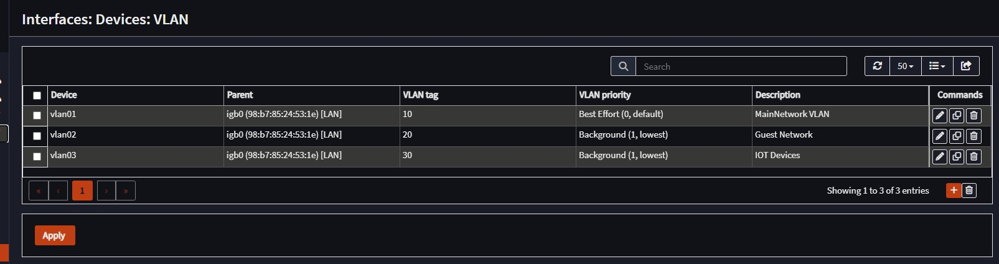

### Step 1.2 — Assign VLAN Interfaces

Navigate to **Interfaces → Assignments**. Each VLAN was assigned as a named interface.

| Interface Name | Identifier | Device |
|---|---|---|
| MainNetworkVLAN | opt1 | vlan01 (igb0, Tag 10) |
| GuestNetwork | opt2 | vlan02 (igb0, Tag 20) |
| IOTDevices | opt3 | vlan03 (igb0, Tag 30) |

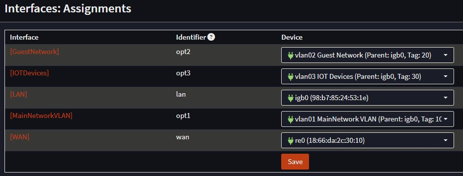

### Step 1.3 — Configure VLAN Interfaces

Each interface enabled with IPv4 Configuration Type set to Static IPv4. The assigned IP becomes the default gateway for that VLAN's subnet.

| Interface | IPv4 Address |
|---|---|
| MainNetworkVLAN | 10.10.10.1 / 24 |
| GuestNetwork | 10.20.20.1 / 24 |
| IOTDevices | 10.30.30.1 / 24 |

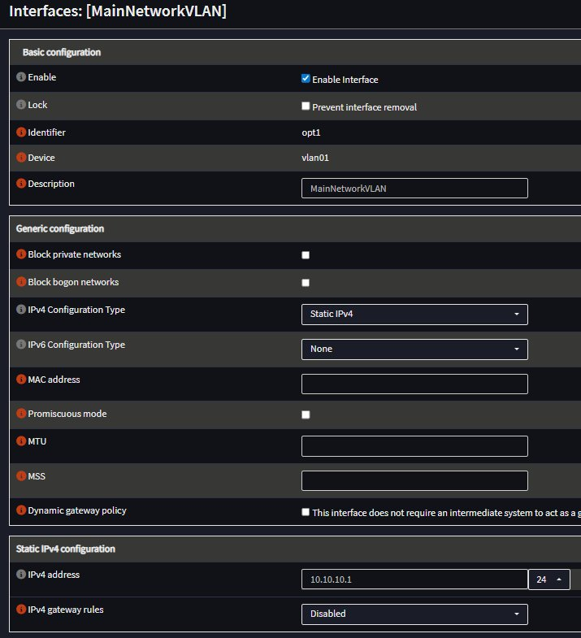

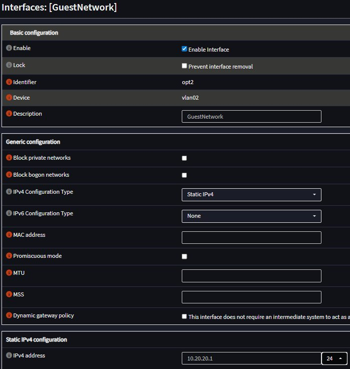

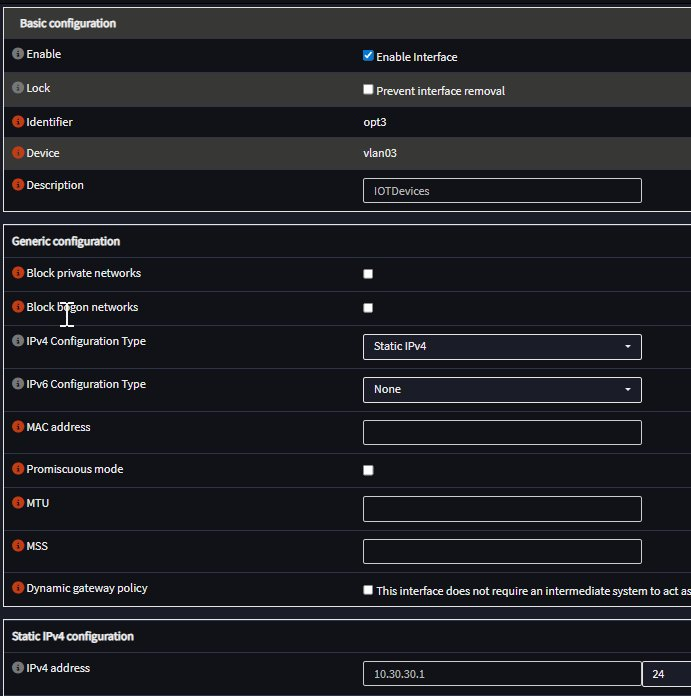

### Step 1.4 — Configure DHCP per VLAN

Kea DHCP was initially configured with subnets for all three VLANs but failed to respond to DHCP requests on VLAN sub-interfaces. After troubleshooting, Kea was disabled and replaced with **dnsmasq**, which is OPNsense's recommended DHCP server for home lab setups.

Navigate to **Services → Dnsmasq DNS & DHCP → General** — enabled dnsmasq and added all three VLAN interfaces alongside LAN to the Interface field. Then under **DHCP Ranges**, added one range per VLAN interface.

> **Important:** The Interface field in the General tab must include the VLAN interfaces and the Apply button must be clicked — without this, dnsmasq will not listen for DHCP requests on those interfaces even if ranges are defined.

| Interface | Start Address | End Address | Description |
|-----------|--------------|-------------|-------------|
| MainNetworkVLAN | 10.10.10.100 | 10.10.10.200 | MainNetworkDHCP |
| GuestNetwork | 10.20.20.100 | 10.20.20.200 | GuestNetworkDHCP |
| IOTDevices | 10.30.30.100 | 10.30.30.200 | IoTDevicesDHCP |

Addresses .1 through .99 on each subnet are reserved for static infrastructure assignments.

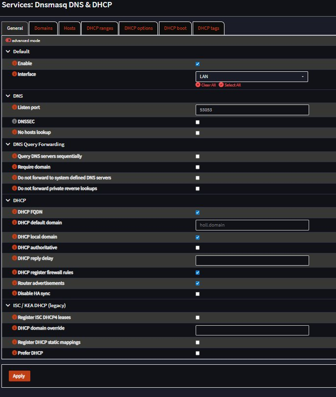
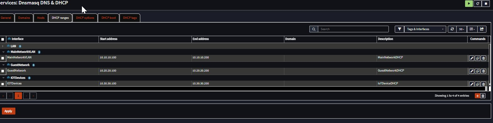

---

## Phase 2 — Firewall Rules

Firewall rules applied per VLAN interface under **Firewall → Rules**. An RFC1918 alias was first created under **Firewall → Aliases** covering all private IPv4 ranges (`10.0.0.0/8`, `172.16.0.0/12`, `192.168.0.0/16`).

**MainNetworkVLAN** — one rule, allow all:

| Action | Source | Destination | Description |
|--------|--------|-------------|-------------|
| Pass | MainNetworkVLAN net | any | Allow Main full access |

**GuestNetwork** — three rules, order critical:

| Action | Source | Destination | Description |
|--------|--------|-------------|-------------|
| Pass | any | GuestNetwork address | Allow Guest to gateway/DNS |
| Block | GuestNetwork net | RFC1918 | Block Guest to internal networks |
| Pass | GuestNetwork net | any | Allow Guest internet |

**IOTDevices** — same pattern as Guest:

| Action | Source | Destination | Description |
|--------|--------|-------------|-------------|
| Pass | any | IOTDevices address | Allow IoT to gateway/DNS |
| Block | IOTDevices net | RFC1918 | Block IoT to internal networks |
| Pass | IOTDevices net | any | Allow IoT internet |

> The gateway allow rule must be first. The RFC1918 alias includes the gateway IP (`10.20.20.1`, `10.30.30.1`), so without an explicit allow rule first, devices cannot reach DNS and have no internet despite the pass rule below.

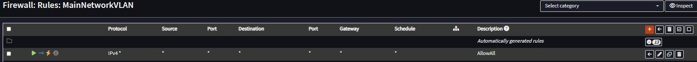
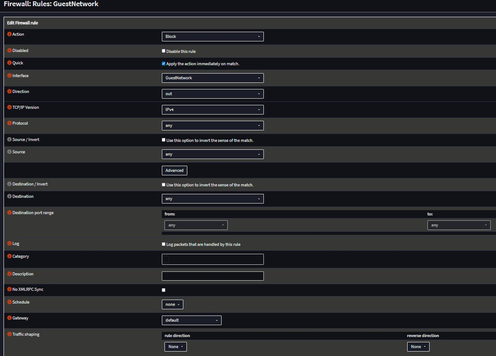
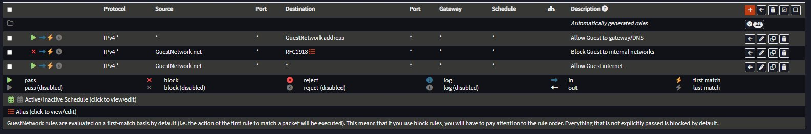


---

## Phase 3 — Switch Configuration (TL-SG108E)

The switch default IP (192.168.1.120) was reassigned to `10.0.0.2` using the TP-Link Easy Smart Configuration Utility, placing it on the OPNsense LAN for permanent management access.

802.1Q VLAN was enabled and three VLANs configured:

| Port | Role | Tagged VLANs | Untagged VLAN | PVID |
|------|------|-------------|---------------|------|
| 1 | OPNsense trunk | 10, 20, 30 | — | 1 |
| 2 | EAP225 trunk | 10, 20, 30 | — | 1 |
| 3 | Domain Controller | — | 10 | 10 |
| 4 | Main PC | — | 10 | 10 |
| 5–8 | Unassigned | — | — | 1 |

**VLAN pruning:** Ports 3–8 are set to Not Member for VLANs 20 and 30 — this is VLAN pruning, the practice of only allowing VLANs on ports that actually need them. A device on Port 3 or 4 cannot send or receive Guest or IoT traffic at the hardware level, regardless of firewall rules. Only the trunk ports (1 and 2) carry all three VLANs because OPNsense needs to route all of them and the AP needs to broadcast all three SSIDs.

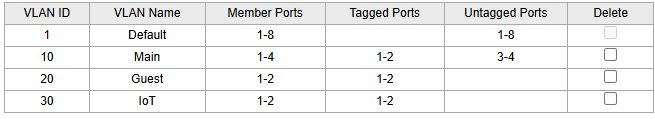
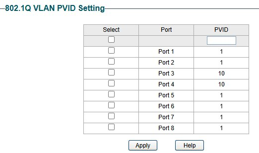

---

## Phase 4 — EAP225 Multi-SSID Configuration

The EAP225 was configured in standalone mode via **Wireless → VLAN**. Each SSID is bound to its VLAN ID, causing the AP to tag all wireless client traffic with the appropriate VLAN before sending it up the trunk to the switch.

| SSID | VLAN ID | Band | Security |
|------|---------|------|----------|
| HomeNetwork | 10 | 2.4GHz | WPA2 |
| GuestNetwork | 20 | 2.4GHz | WPA2 |
| IoT Devices | 30 | 2.4GHz | WPA2 |

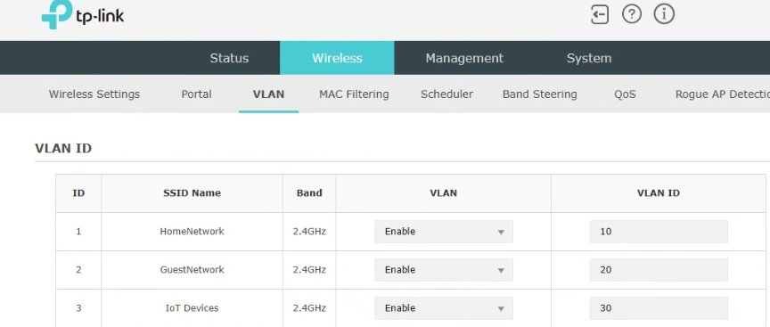

---

## Phase 5 — AP Management Access

The EAP225 management interface sits on the native LAN (`10.0.0.0/24`) which is a separate subnet from VLAN 10 (`10.10.10.0/24`). The AP's embedded web server rejects TCP connections from foreign subnets even when routing succeeds — confirmed via `curl` timing out on port 443 while ICMP pings succeeded.

**AP static IP via DHCP reservation:**
A host reservation was added in dnsmasq under **Services → Dnsmasq DNS & DHCP → Hosts** binding the AP's MAC address (`cc:ba:bd:cf:ba:90`) to `10.0.0.3`, giving the AP a permanent predictable address without configuring it manually on the AP itself.

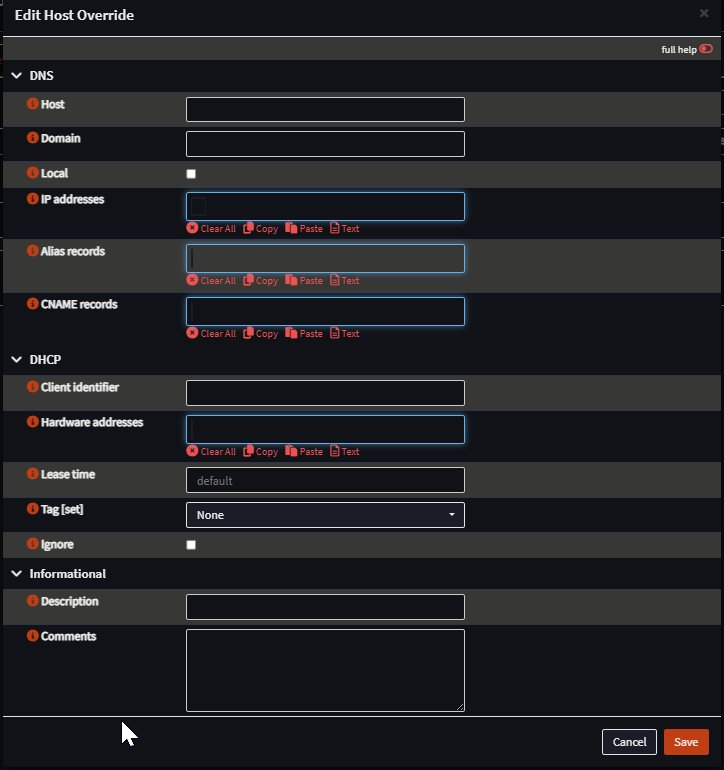

**Management access from main PC via outbound NAT:**
An outbound NAT rule was added under **Firewall → NAT → Outbound** (switched to Hybrid mode) to masquerade VLAN 10 traffic destined for the native LAN as coming from OPNsense's LAN address (`10.0.0.1`). The AP sees all management requests as originating from `10.0.0.1` — same subnet — and accepts them.

| Field | Value |
|---|---|
| Interface | LAN |
| Source | MainNetworkVLAN net |
| Destination | LAN net |
| Translation | Interface address (10.0.0.1) |

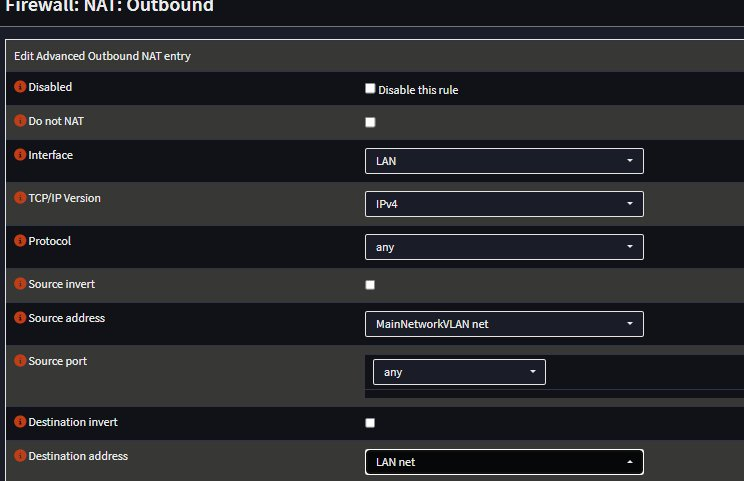

The AP management interface is now accessible from the main PC at `https://10.0.0.3`.

---

## Verification

Connectivity verified per VLAN using the following commands from a device on each network:

| Test | Command | Expected Result |
|------|---------|-----------------|
| DHCP working | `ipconfig` (Windows) / `ip a` (Linux) | IP in correct pool range |
| Gateway reachable | `ping 10.10.10.1` (or .20.1 / .30.1) | Reply from gateway |
| Internet routing | `ping 8.8.8.8` | Reply from Google DNS |
| DNS resolving | `ping google.com` | Resolves and replies |
| VLAN isolation | `ping 10.10.10.1` from Guest or IoT | Request timed out |
| AP reachable from Main | `curl -k https://10.0.0.3` | Returns HTML |

Results:

- [x] VLAN 10 (Main) — DHCP assigns `10.10.10.100–200`; gateway, `8.8.8.8`, and `google.com` all reply; wired and wireless confirmed
- [x] VLAN 20 (Guest) — DHCP assigns `10.20.20.100–200`; internet confirmed; ping to `10.10.10.1` times out — isolation working
- [x] VLAN 30 (IoT) — DHCP assigns `10.30.30.100–200`; internet confirmed; ping to `10.10.10.1` times out — isolation working

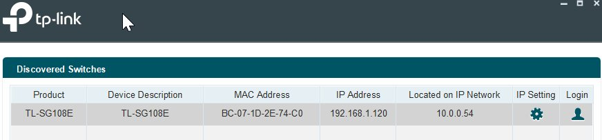


---

## Troubleshooting

### Issue 1 — Kea DHCP not responding on VLAN interfaces ✅ RESOLVED

**Symptom:** After switch VLAN configuration, no devices received DHCP leases on any VLAN interface. `ipconfig /renew` timed out on all tested devices.

**What was checked:**
- Kea Settings confirmed all three VLAN interfaces listed and service enabled
- Subnets confirmed correctly defined with pools
- Kea service restarted — no change
- Socket type changed from `raw` to `udp` — no change

**Resolution:** Kea DHCP disabled and replaced with dnsmasq. OPNsense's own documentation recommends dnsmasq for home lab setups. After disabling Kea, rebooting OPNsense to release port 67, and configuring dnsmasq DHCP ranges with all VLAN interfaces added to the General tab, DHCP began responding correctly on all three VLANs.

**Root cause:** Kea DHCP has known issues binding to VLAN sub-interfaces in OPNsense 26.1. Dnsmasq handles this reliably.

---

### Issue 2 — AP management lockout via incorrect Management VLAN order

**Symptom:** EAP225 management became completely inaccessible from all devices after enabling Management VLAN 10 while the AP's management IP was still `10.0.0.3` (native LAN subnet).

**Root cause:** The AP's management VLAN and management IP must match. Enabling Management VLAN 10 restricted management traffic to VLAN 10 tagged frames only, but the AP's IP was on the native untagged VLAN 1 network. All management requests arrived untagged and were rejected by the AP.

**Resolution:** Factory reset the EAP225 (hold reset button 8–10 seconds). On reconfiguration, the correct order was followed: set SSIDs and VLAN IDs first, then change management IP to `10.10.10.3`, then enable Management VLAN 10.

**Lesson learned:** Always change the management IP to the target subnet before enabling a Management VLAN restriction. Doing it in the wrong order causes an immediate and complete lockout.

---

### Issue 4 — RFC1918 block rule preventing DNS on Guest and IoT VLANs ✅ RESOLVED

**Symptom:** Devices connecting to GuestNetwork and IoT Devices SSIDs received correct DHCP addresses but had no internet access.

**Root cause:** The RFC1918 alias includes all private IP ranges including the VLAN gateway IPs (`10.20.20.1`, `10.30.30.1`). The block rule was firing before DNS queries could reach the gateway, silently dropping all DNS traffic and making internet appear broken despite the allow-all rule below it.

**Resolution:** Added a Pass rule at the top of both Guest and IoT rule sets with destination set to the interface address (the gateway IP). This explicitly allows DNS and gateway traffic before the RFC1918 block rule is evaluated.

**Lesson learned:** When using RFC1918 as a block destination on isolated VLANs, always add an explicit allow rule for the VLAN's own gateway address first — otherwise devices can't reach DNS and have no internet access.

---

## Outcome

Three fully isolated VLANs deployed across OPNsense, a managed switch, and a wireless access point:

- **Main (VLAN 10)** — `10.10.10.0/24` — full internet and inter-VLAN access; wired PC, DC, and HomeNetwork SSID
- **Guest (VLAN 20)** — `10.20.20.0/24` — internet only; cannot reach Main or IoT networks
- **IoT (VLAN 30)** — `10.30.30.0/24` — internet only; fully isolated from all other VLANs

DHCP, DNS, firewall isolation, and wireless SSID-to-VLAN mapping all confirmed working. AP management accessible from main PC via outbound NAT masquerading. Switch management accessible at `10.0.0.2`.

Key skills demonstrated through real troubleshooting: DHCP server migration (Kea → dnsmasq), firewall rule ordering, 802.1Q trunk/access port configuration, outbound NAT for cross-subnet management access, and AP management VLAN behaviour.

# mDNS Repeater — IoT Device Discovery Across VLANs

## Problem

IoT devices such as printers advertise themselves using mDNS (Multicast DNS / Bonjour). Because VLANs are separate broadcast domains, these announcements never cross VLAN boundaries. A printer on the IoT VLAN is invisible to devices on the Main VLAN even though the firewall allows traffic between them.

## Solution

Install **os-mdns-repeater** on OPNsense to proxy mDNS announcements between VLANs. This solves discovery only — isolation is preserved. IoT devices still cannot initiate connections to the Main network.

> **Static IP:** Giving IoT devices a DHCP reservation is good practice but not required. The mDNS announcement includes the device's current IP, so discovery works with dynamic addresses.

---

## Steps

**1 — Install plugin**
System → Firmware → Plugins → search `os-mdns-repeater` → install → reload page.


**2 — Configure repeater**
Services → MDNS Repeater → Enable → set Listen Interfaces to `IOTDevices` and `MainNetworkVLAN` → Apply.

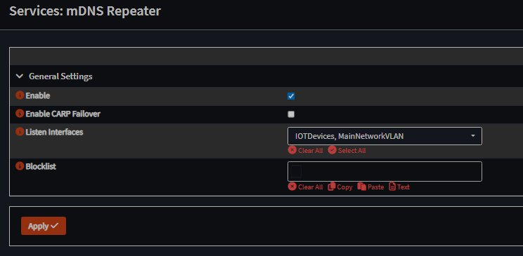

**3 — Allow mDNS traffic**
Add the following rule to both **Firewall → Rules → MainNetworkVLAN** and **Firewall → Rules → IOTDevices**:

| Field | Value |
|---|---|
| Action | Pass |
| Protocol | UDP |
| Source | respective VLAN net |
| Destination | `224.0.0.251` |
| Destination Port | `5353` |
| Description | Allow mDNS |

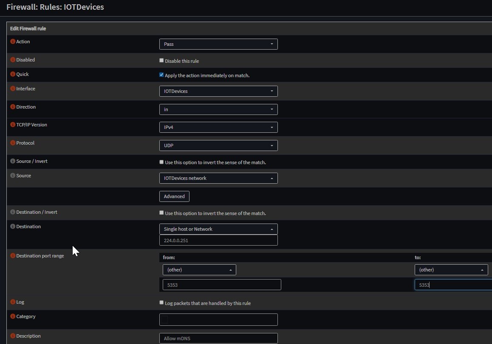

---

## Result

Main network devices can now discover and communicate with IoT VLAN devices automatically. IoT devices remain unable to initiate connections to the Main network — isolation intact.

<!-- screenshot: 04_verification.png -->


---

## Next Steps

- [Part 3 — Windows Server 2022 Active Directory Domain](https://github.com/TannerHollaway)

---

